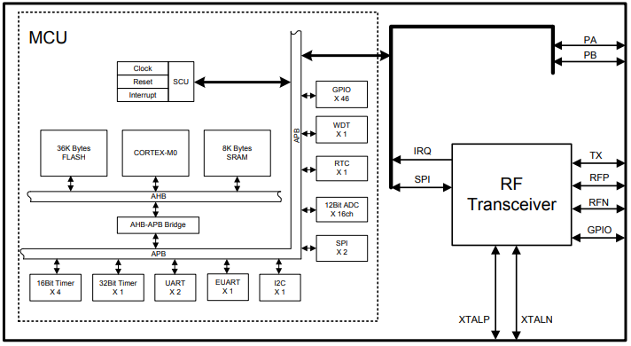

# [HW3181](https://github.com/SoCXin/HW3181)

#### [Vendor](https://github.com/SoCXin/Vendor) ：[Eastsoft](http://www.essemi.com/)
#### [Core](https://github.com/SoCXin/Cortex)：[Cortex M0](https://github.com/SoCXin/CM0)
#### [Level](https://github.com/SoCXin/Level) ：48 MHz * 0.9 DMIPS/MHz

## [HW3181简介](https://github.com/SoCXin/HW3181/wiki)

[HW3181](https://github.com/SoCXin/HW3181)

#### 关键特性

* 433/780/868/915MHz
* 30mA@10dBm TX
* 最大输出功率：+20 dBm
* 接收灵敏度：-114dBm@10Kbps(433MHz)，-109dBm@50kbps(433MHz)

### [资源收录](https://github.com/SoCXin/HW3181)

* [参考文档](docs/)
* [参考资源](src/)
* [参考工程](project/)

### [选型建议](https://github.com/SoCXin)

[HW3181](https://github.com/SoCXin/HW3181)

###  [SoC.芯](http://www.SoC.Xin)
